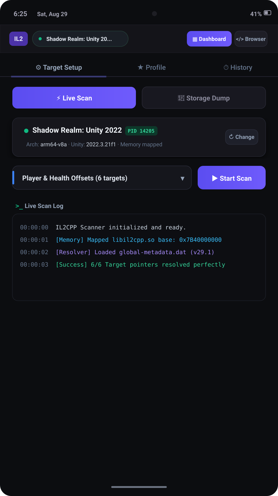
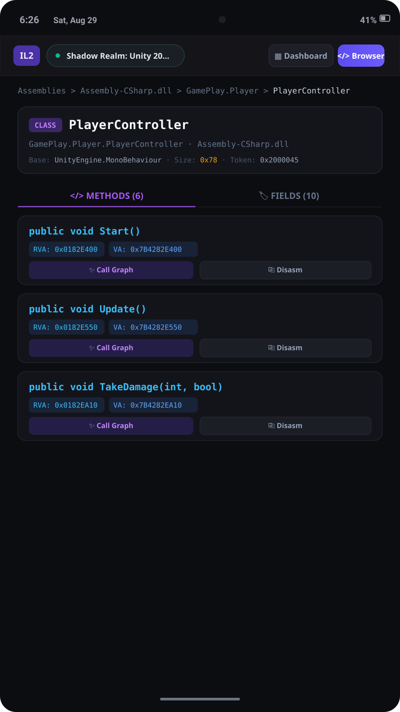
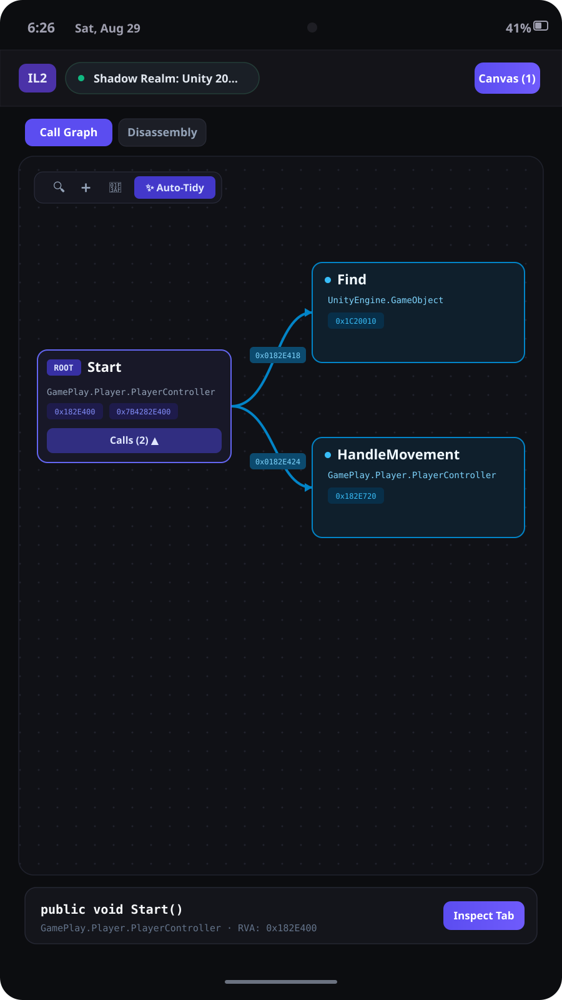
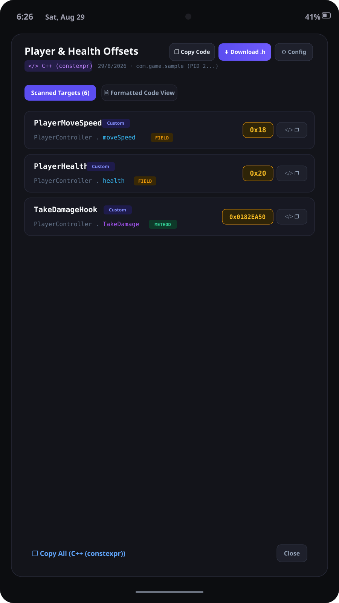
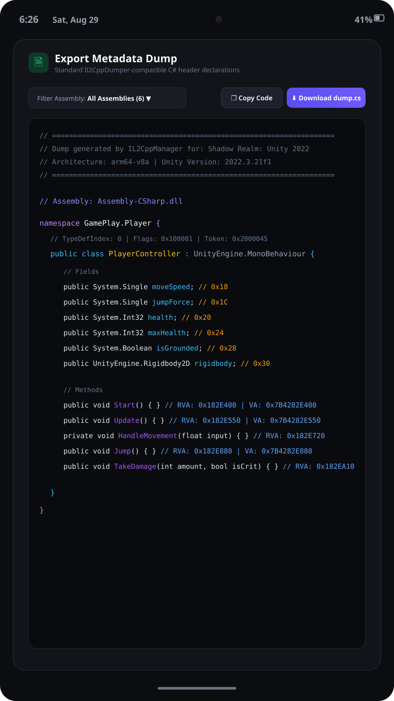

<p align="center">
  
</p>

<h1 align="center">IL2CppManager (Android Edition)</h1>

<p align="center">
  <strong>Native Android &amp; Mobile Workbench for Unity IL2CPP Runtime Inspection, Target Scanning &amp; Reverse Engineering</strong><br>
  A high-performance Android application built with Capacitor, React, and TypeScript for inspecting Unity metadata, managing target watchlist profiles, disassembling ARM64 native instructions, visualizing interactive call graphs, and exporting offset code headers directly on mobile devices.
</p>

<p align="center">
  <a href="#features"></a>
  <a href="#features"></a>
  <a href="#features"></a>
  <a href="#features"></a>
  <a href="#features"></a>
  <a href="LICENSE"></a>
</p>

---

## 📸 Android App Screenshots

### 1. Live Memory Scanner & Target Setup
Attach to running Unity IL2CPP game processes (PID mapped), manage watchlist profile targets, trigger real-time memory scans, and stream live resolution logs directly on Android.

<p align="center">
  
</p>

### 2. Hierarchical Metadata Browser
Inspect loaded assemblies (`Assembly-CSharp.dll`, `UnityEngine.CoreModule.dll`), classes, inheritance structures, struct memory sizes, field offset pointers, and method RVAs on mobile touch displays.

<p align="center">
  
</p>

### 3. Interactive Call Graph & ARM64 Disassembler
Trace method caller/callee execution flow with dynamic touch-draggable Bezier graph nodes, perform single-tap Auto-Tidy layout reorganization, and inspect decoded ARM64 machine instructions.

<p align="center">
  
</p>

### 4. Multi-Format Code & C# Dump Exporter
Export resolved offsets into clean code snippets across multiple formats (C++ constexpr headers, C# structs, Il2CppType definitions, Frida JavaScript hooks, Cheat Engine `.CT` tables) or generate complete Il2CppDumper-compatible C# dumps.

<p align="center">
  
  &nbsp;&nbsp;
  
</p>

---

## ⚡ Android App Features

- **Mobile Process & Target Management:**
  - Attach to active Unity game processes by package name or PID.
  - Organize reverse-engineering targets into modular profiles with customizable aliases and fallbacks.
  - Stream live scanning logs with memory-mapped `libil2cpp.so` base address resolution.

- **Touch-Optimized Metadata Explorer:**
  - Browse assemblies, namespaces, TypeDef sizes, fields, and method RVAs.
  - Instant symbol search with responsive Android navigation drawer and touch-friendly controls.

- **Visual Call Graph & ARM64 Disassembly:**
  - Interactive Bezier call graphs with drag, pinch-to-zoom, and Auto-Tidy canvas positioning.
  - Native ARM64 disassembler detailing opcodes (`STP`, `LDR`, `CMP`, `BL`, `RET`), registers, and branch targets.

- **Header & Script Generator:**
  - Multi-language offset exporter (C++, C#, Frida, Cheat Engine, Custom Templates).
  - Complete `dump.cs` C# metadata export with single-tap clipboard copy and file download.

- **Offline-First Persistence:**
  - 100% offline functionality on Android device storage with JSON backup and restore.

---

## 📲 Building the Android APK

### Option 1: Automated GitHub Actions (Recommended)
This repository includes a preconfigured GitHub Actions workflow (`.github/workflows/build-apk.yml`) that automatically builds the Android Debug APK on every push:
1. Push your changes to GitHub.
2. Go to the **Actions** tab in your repository.
3. Select the **Build Android APK (Autonomous)** workflow.
4. Download the ready-to-install `IL2CppManager-Android-APK` from the **Artifacts** section.

### Option 2: Local Android Build

```bash
# 1. Install dependencies
npm install

# 2. Build the web bundle
npm run build

# 3. Initialize & sync Android Capacitor project
npx cap add android
npx cap sync android

# 4. Build debug APK using Gradle
cd android
./gradlew assembleDebug

# Output APK path:
# android/app/build/outputs/apk/debug/app-debug.apk
```

---

## 🛠️ Tech Stack & Architecture

- **Runtime:** Android Native via Capacitor (`@capacitor/android`, `@capacitor/cli`, `@capacitor/core`)
- **Frontend:** React 18 & TypeScript
- **Styling:** Tailwind CSS v4 (Mobile-First Android Dark Theme)
- **Animations:** Motion (`motion/react`)
- **Icons:** Lucide React

---

## 📄 License

IL2CppManager is released under the [Apache License 2.0](LICENSE).
