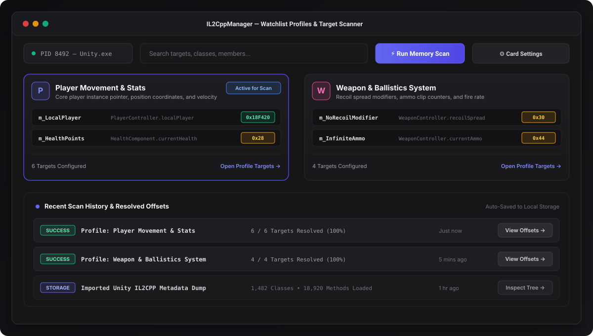
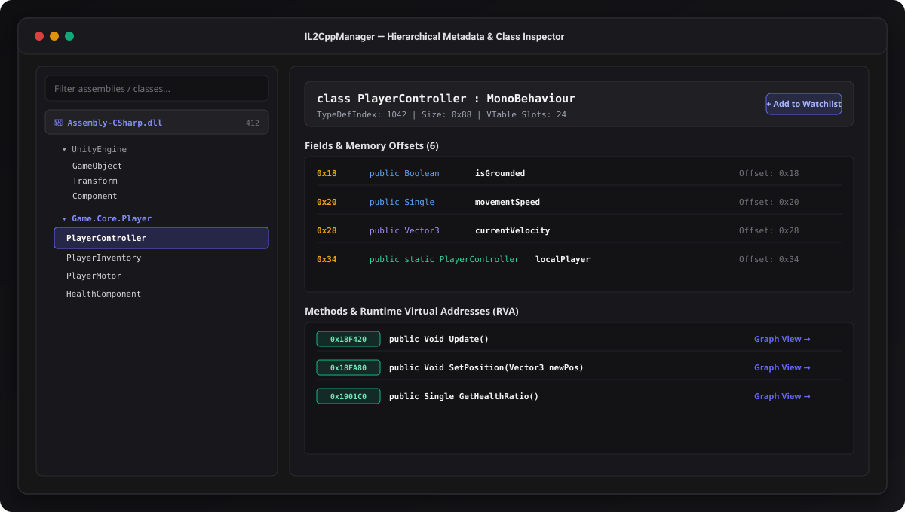
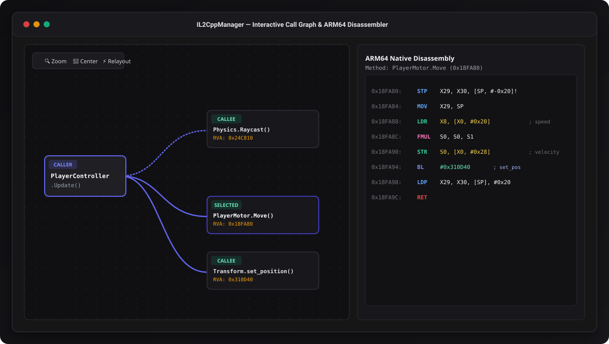
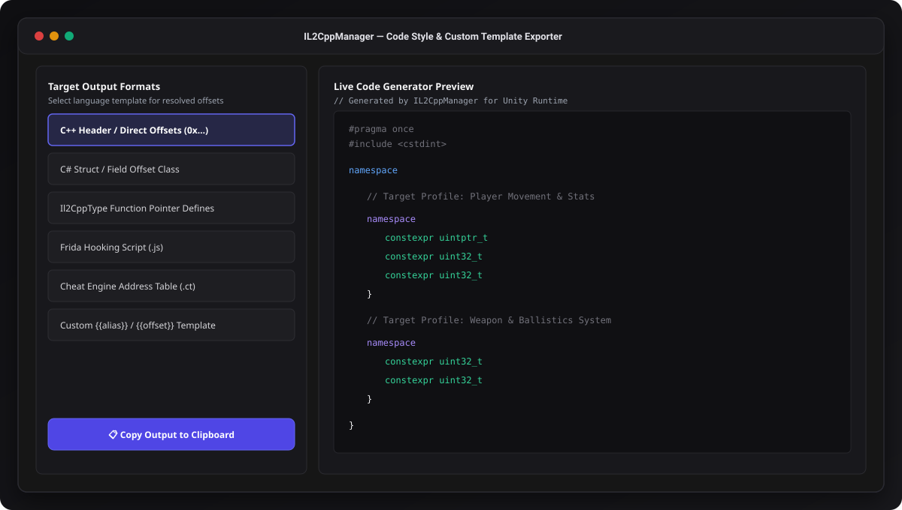

<p align="center">
  
</p>

<h1 align="center">IL2CppManager (Web Edition)</h1>

<p align="center">
  <strong>Advanced Unity IL2CPP Runtime Metadata Inspector, Target Scanner &amp; Reverse-Engineering Workbench</strong><br>
  A high-performance React &amp; TypeScript developer workbench for inspecting metadata, tracking custom watchlist profiles, disassembling ARM64 native instructions, visualizing interactive call graphs, and exporting multi-format offset headers.
</p>

<p align="center">
  <a href="#features"></a>
  <a href="#features"></a>
  <a href="#features"></a>
  <a href="LICENSE"></a>
</p>

---

## 📸 Screenshots & Overview

### 1. Watchlist Profiles & Memory Scanner Dashboard
Organize reverse-engineering targets into modular profiles (e.g. Player, Weapons, Physics), run live scans, and customize card densities and visibility.

<p align="center">
  
</p>

### 2. Hierarchical Metadata & Offset Browser
Inspect Unity assemblies (`Assembly-CSharp.dll`), namespaces, classes, struct sizes, fields with memory offsets, and method RVAs.

<p align="center">
  
</p>

### 3. Interactive Call Graph & ARM64 Native Disassembler
Trace caller/callee relationships with interactive Bezier graph nodes, inspect decoded ARM64 machine instructions, registers, branches, and method invocation targets.

<p align="center">
  
</p>

### 4. Code Style & Custom Template Exporter
Export resolved offsets into clean code snippets across multiple languages and tooling formats: C++ headers, C# structs, Il2CppType definitions, Frida JavaScript hooks, Cheat Engine `.CT` address tables, or custom dynamic templates.

<p align="center">
  
</p>

---

## ⚡ Key Features

- **Watchlist & Profile Manager:**
  - Create and manage custom target profiles for organized reverse engineering.
  - Add specific classes, fields, methods, custom aliases, fallbacks, and comments.
  - Multi-profile selection and active scan state toggle.

- **Granular Display Customization:**
  - **Profile Card Settings:** Toggle description, target count badge, target preview chips, active scan badge, and quick action buttons.
  - **Target Card Settings:** Independent toggles for custom aliases, comments, fallbacks, class names, member names, kind badges, and density.
  - **History Card Settings:** Configure scan log metadata, code style badges, and quick actions.
  - Responsive layouts with automatic mobile-optimized single-column views and tablet/desktop grid options.

- **Hierarchical Metadata Explorer:**
  - Browse assemblies, namespaces, class inheritance, TypeDef sizes, fields, and methods.
  - Fast search with case-sensitive filtering, exact match, and global symbol search.

- **Interactive Method Call Graph:**
  - Dynamic node canvas with draggable nodes, pan, zoom, fit-to-screen, and recursive caller/callee traversal.
  - Direct deep-dive into ARM64 native disassembler with decoded opcodes (`LDR`, `STR`, `BL`, `MOV`, `RET`).

- **Multi-Format Code Generator & Exporter:**
  - **C++ Headers (`#pragma once`, `constexpr`)**
  - **C# Structs & Offset Classes**
  - **Il2CppType Function Pointer Definitions**
  - **Frida Hooking Scripts (`.js`)**
  - **Cheat Engine XML Address Tables (`.ct`)**
  - **Custom Dynamic Mustache Templates (`{{alias}}`, `{{offset}}`, `{{rva}}`)**

- **Scan History & Local Persistence:**
  - Automatic scan history logging with resolved offset snapshots.
  - Zero server dependencies with instant `localStorage` persistence and JSON import/export.

---

## 🚀 Getting Started

### Prerequisites
- Node.js 18+ or Bun
- Modern web browser (Chrome, Firefox, Edge, Safari)

### Installation & Development

```bash
# Clone the repository
git clone https://github.com/your-username/il2cppmanager.git

# Navigate into project directory
cd il2cppmanager

# Install dependencies
npm install

# Start development server on port 3000
npm run dev
```

### Production Build

```bash
# Build optimized static distribution
npm run build

# Preview build locally
npm run preview
```

---

## 🛠️ Tech Stack

- **Framework:** React 18 & TypeScript
- **Styling:** Tailwind CSS v4
- **Icons:** Lucide React
- **Animations:** Motion (`motion/react`)
- **State & Storage:** React Hooks & LocalStorage Engine

---

## 📄 License

IL2CppManager is released under the [Apache License 2.0](LICENSE).


